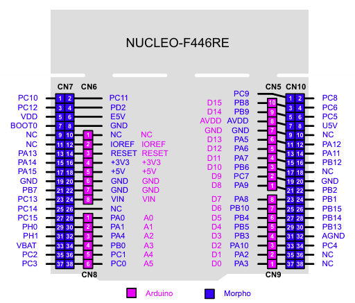
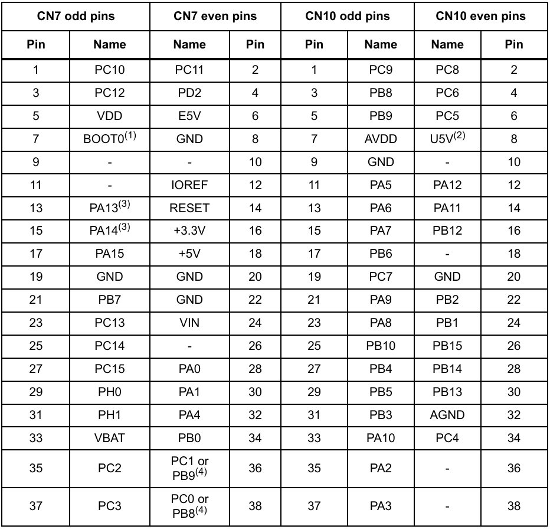
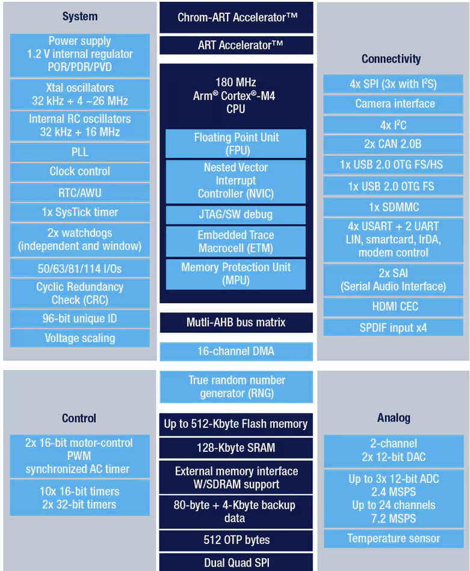

# STM32_Starlet_ECU

## 使用ボード
- ST Micro 製 NUCLEO-F446RE
- ボードピン配置は下図を参照のこと

- マイコンピンとボートピンの対応は下図を参照のこと

## 使用マイコン
 - ST Micro製 STM32マイコン (型番：STM32F446RET6)
 - 構成は添付図を参照のこと

##ボードピンアサイン

### システムピンアサイン(CN7)

CN7 の NUCREO(Morpho) → MCU ピン対応は下表のとおり

| Morpho PIN | MCU PIN | システム機能 | MCU機能 | 備考 |
|---:|:---:|:---|:---|:---|
| 1 | PC10 | 点火信号 |  |  |
| 2 | PC11 |  |  |  |
| 3 | PC12 | インジェクタ #10 |  |  |
| 4 | PD2 |  |  |  |
| 5 | VDD |  |  |  |
| 6 | E5V | 外部からの5V入力 |  |  |
| 7 | BOOT0 |  |  |  |
| 8 | GND |  |  |  |
| 9 | - |  |  |  |
| 10 | - |  |  |  |
| 11 | - |  |  |  |
| 12 | IOREF |  |  |  |
| 13 | PA13 |  |  |  |
| 14 | RESET | 外部リセット |  |  |
| 15 | PA14 |  |  |  |
| 16 | +3.3V | 3.3V電源 |  |  |
| 17 | PA15 |  |  |  |
| 18 | +5V | 5V電源 |  |  |
| 19 | GND | GND |  |  |
| 20 | GND | GND |  |  |
| 21 | PB7 | インジェクタ #20 |  |  |
| 22 | GND |  |  |  |
| 23 | PC13 |  |  |  |
| 24 | VIN | 外部からの7~12V入力 |  |  |
| 25 | PC14 |  |  |  |
| 26 | - |  |  |  |
| 27 | PC15 |  |  |  |
| 28 | PA0 |  |  |  |
| 29 | PH0 |  |  |  |
| 30 | PA1 |  |  |  |
| 31 | PH1 |  |  |  |
| 32 | PA4 | 油圧センサ入力 | ADC123_IN3 |  |
| 33 | VBAT |  |  |  |
| 34 | PB0 |  |  |  |
| 35 | PC2 | 油圧センサ IN |  |  |
| 36 | PC1 or PB9 | 半田オプション |  |  |
| 37 | PC3 | MAPSセンサ IN | ADC12_IN5 |  |
| 38 | PC0 or PB8 | 半田オプション |  |  |

## システムピンアサイン(CN10)

CN10 の NUCLEO(Morpho) → MCU ピン対応は下表のとおり

| Morpho PIN | MCU PIN | 機能 | MCU機能 | 備考 |
|---:|:---:|:---|:---|:---|
| 1 | PC9 |  |  |  |
| 2 | PC8 |  |  |  |
| 3 | PB8 | G1 IN |  |  |
| 4 | PC6 | NE入力 |  |  |
| 5 | PB9 | G2 IN |  |  |
| 6 | PC5 |  |  |  |
| 7 | AVDD | アナログ電源 |  |  |
| 8 | U5V | USBからの5V |  |  |
| 9 | GND |  |  |  |
| 10 | - |  |  |  |
| 11 | PA5 |  |  |  |
| 12 | PA12 |  |  |  |
| 13 | PA6 | A/Fセンサ IN | ADC12_IN6 |  |
| 14 | PA11 |  |  |  |
| 15 | PA7 | ノックセンサ IN | ADC12_IN7 |  |
| 16 | PB12 |  |  |  |
| 17 | PB6 |  |  |  |
| 18 | - |  |  |  |
| 19 | PC7 |  |  |  |
| 20 | GND |  |  |  |
| 21 | PA9 | インジェクタ #30 |  |  |
| 22 | PB2 |  |  |  |
| 23 | PA8 | インジェクタ #40 |  |  |
| 24 | PB1 |  |  |  |
| 25 | PB10 |  |  |  |
| 26 | PB15 |  |  |  |
| 27 | PB4 | NE入力 |  |  |
| 28 | PB14 |  |  |  |
| 29 | PB5 |  |  |  |
| 30 | PB13 |  |  |  |
| 31 | PB3 |  |  |  |
| 32 | AGND |  |  |  |
| 33 | PA11 |  |  |  |
| 34 | PC4 | 水温センサ IN | ADC12_IN14 |  |
| 35 | PA2 |  |  |  |
| 36 | 0 |  |  |  |
| 37 | PA3 |  |  |  |
| 38 | - |  |  |  |

